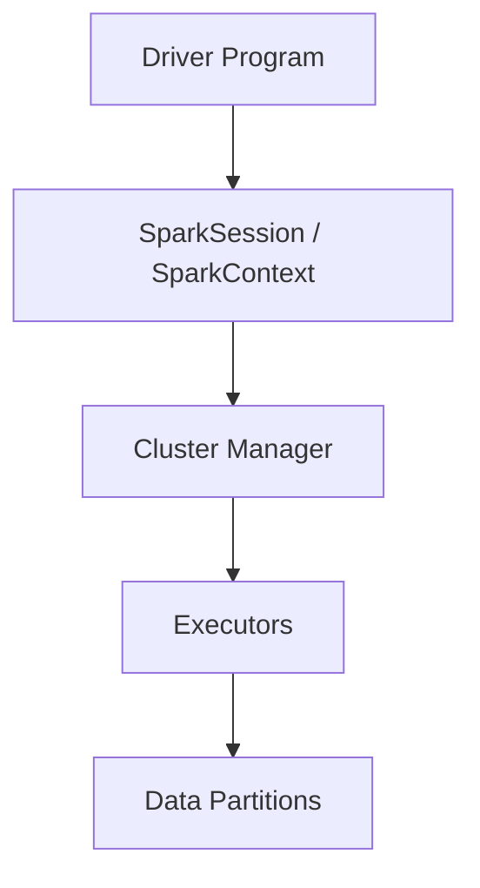

# Introduction to Apache Spark and PySpark

*⏱ Estimated time: 35 minutes*

:::note[🎯 Learning objectives]

By the end of this section, you will be able to:

- Describe what Apache Spark is and how the driver, executors, and partitions cooperate.
- Explain the relationship between Spark and PySpark.
- Identify Data Engineering workloads where Spark is a better fit than a single-process tool like pandas.

:::

### What is Apache Spark?

Apache Spark is a distributed data processing engine.

It can process large datasets across:

- One computer.
- Multiple computers.
- Cloud clusters.
- Databricks.
- Kubernetes.
- Hadoop YARN.

Spark divides data into partitions and processes those partitions in parallel.

A simplified architecture:



### What is PySpark?

PySpark is the Python API for Apache Spark.

It allows Data Engineers to write Spark applications using Python.

<Tabs groupId="env">
<TabItem value="databricks" label="🧱 Databricks notebook" default>

```python
data = [
    ("Laptop", 2, 65000.0),
    ("Monitor", 3, 15000.0),
    ("Keyboard", 5, 2000.0),
]

df = spark.createDataFrame(
    data,
    ["product", "quantity", "unit_price"]
)

df.show()
```

</TabItem>
<TabItem value="local" label="🪟 Local Python">

```python
from pyspark.sql import SparkSession

spark = (
    SparkSession.builder
    .appName("HitaVirTechIntroduction")
    .master("local[*]")
    .getOrCreate()
)

# ... same DataFrame code as above ...

spark.stop()
```

</TabItem>
</Tabs>

Expected output:

```text
+--------+--------+----------+
| product|quantity|unit_price|
+--------+--------+----------+
|  Laptop|       2|   65000.0|
| Monitor|       3|   15000.0|
|Keyboard|       5|    2000.0|
+--------+--------+----------+
```

### Why Spark is used in Data Engineering

Spark is used because it supports:

- Distributed batch processing.
- SQL analytics.
- Streaming.
- Machine learning.
- Graph processing.
- Multiple data formats.
- Cloud storage.
- Scalable transformations.

### Real-world use cases

- Processing terabytes of logs.
- Building lakehouse pipelines.
- Aggregating sales from thousands of stores.
- Processing clickstream data.
- Transforming IoT events.
- Preparing data for analytics.
- Incremental ingestion.
- Feature engineering.
- Data quality checks.
- CDC processing.

### HitaVir Tech scenario

HitaVir Tech receives daily sales files from hundreds of branches.

A single pandas process may work for small files, but the data volume is growing.

PySpark allows HitaVir Tech to:

- Read many files in parallel.
- Process large volumes.
- Join sales with product and customer data.
- Partition outputs.
- Scale from a laptop to a cluster.
- Move the same logic to Databricks.

### Spark components

#### Driver

The driver:

- Runs the main application.
- Creates the SparkSession.
- Builds the execution plan.
- Coordinates tasks.
- Collects results from executors.

#### Executors

Executors:

- Run tasks.
- Process partitions.
- Cache data.
- Return results to the driver.

#### Partitions

A partition is a logical chunk of data.

Spark processes partitions in parallel.

```python
# Local or classic clusters only.
# The RDD API is unavailable on serverless compute.
print(df.rdd.getNumPartitions())
```

### ✅ Checkpoint

You should be able to explain:

- Spark is a distributed processing engine.
- PySpark is Spark's Python interface.
- The driver coordinates work.
- Executors process partitions.
- DataFrames are distributed collections of rows.

### 🛠️ Exercise

Write three reasons why PySpark is useful for Data Engineering.

<details>
<summary>Show solution</summary>

```text
1. It processes large datasets in parallel.
2. It supports structured transformations and SQL.
3. It can scale from local development to distributed clusters.
```

</details>

<Quiz
  questions={[
  {
    "question": "Which Spark component builds the execution plan and coordinates tasks?",
    "options": [
      "An executor",
      "The driver",
      "A partition"
    ],
    "answer": 1,
    "explanation": "The driver plans and coordinates; executors process partitions."
  },
  {
    "question": "A Spark DataFrame is best described as:",
    "options": [
      "A pandas DataFrame stored in one process",
      "A distributed, lazily evaluated collection of rows",
      "A file format"
    ],
    "answer": 1,
    "explanation": "It is distributed across partitions and only computed when an action runs."
  }
]}
/>

:::info[📌 Key takeaways]

- Spark splits data into partitions and processes them in parallel across executors, coordinated by the driver.
- PySpark is the Python API over the same distributed engine.
- Thinking in partitions, shuffles, and execution plans matters more than Python syntax.

:::

:::tip[💡 HitaVir Tech Tip]

Do not think of a Spark DataFrame as a pandas DataFrame stored in one process. A Spark DataFrame is distributed and lazily evaluated.

:::

:::info[🚀 Pro Tip]

Spark performance depends more on partitioning, shuffles, file layout, and execution plans than on Python syntax.

:::
