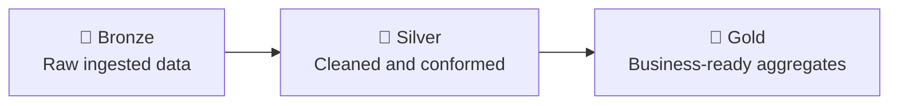

# Introduction to Databricks and Delta Lake

*⏱ Estimated time: 60 minutes*

:::note[🎯 Learning objectives]

By the end of this section, you will be able to:

- Explain the guarantees Delta Lake adds on top of Parquet.
- Write and read Unity Catalog Delta tables and perform a merge.
- Map the medallion architecture onto this course's data layers.

:::

### Databricks

Databricks provides:

- Managed Spark.
- Notebooks.
- SQL warehouses.
- Jobs and workflows.
- Delta Lake.
- Governance.
- Cluster and serverless compute.
- Cloud integrations.

### Delta Lake

Delta Lake adds:

- ACID transactions.
- Schema enforcement.
- Schema evolution.
- Time travel.
- Merge operations.
- Reliable batch and streaming.

Example in Databricks (tables are Delta by default and governed by Unity Catalog):

```python
(
    clean_sales_df.write
    .mode("overwrite")
    .saveAsTable("workspace.default.clean_sales")
)
```

Read:

```python
delta_df = spark.read.table(
    "workspace.default.clean_sales"
)
```

:::note[Note]

New Databricks workspaces, including Free Edition, use Unity Catalog. Legacy DBFS mount paths such as `/mnt/...` are not available; use catalog tables or volume paths instead.

:::

### Merge concept

```python
from delta.tables import DeltaTable

target = DeltaTable.forName(
    spark,
    "workspace.default.clean_sales"
)

(
    target.alias("t")
    .merge(
        updates_df.alias("s"),
        "t.transaction_id = s.transaction_id"
    )
    .whenMatchedUpdateAll()
    .whenNotMatchedInsertAll()
    .execute()
)
```

### Medallion architecture



Bronze:

- Raw ingested data.

Silver:

- Cleaned and conformed data.

Gold:

- Business-ready aggregates.

### HitaVir Tech mapping

```text
{BASE_PATH}/raw          → Bronze
{BASE_PATH}/processed    → Silver
regional_summary         → Gold
product_summary          → Gold
```

<Quiz
  questions={[
  {
    "question": "Compared with plain Parquet, Delta Lake adds:",
    "options": [
      "Columnar storage",
      "ACID transactions, schema enforcement, and time travel",
      "CSV compatibility"
    ],
    "answer": 1,
    "explanation": "Delta is a transactional layer over Parquet files."
  },
  {
    "question": "In the medallion architecture, the Silver layer holds:",
    "options": [
      "Raw ingested data",
      "Cleaned and conformed data",
      "Dashboards"
    ],
    "answer": 1,
    "explanation": "Bronze is raw, Silver is clean, Gold is business-ready."
  }
]}
/>

:::info[📌 Key takeaways]

- On Databricks, tables are Delta by default and governed by Unity Catalog.
- Delta adds ACID transactions, schema enforcement, time travel, and merges over Parquet.
- Bronze → Silver → Gold maps directly onto this course's raw → processed → summary layers.

:::

:::tip[💡 HitaVir Tech Tip]

Understand Spark fundamentals before relying on Databricks abstractions.

:::

:::info[🚀 Pro Tip]

Delta Lake solves many reliability problems that plain Parquet cannot solve alone.

:::
